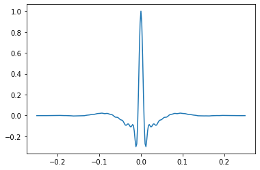

:hide-toc:

.. container:: noclass
   :name: forkongithub

   `Fork on GitHub <https://github.com/agilescientific/bruges>`_

bruges is a
===========

.. image:: http://agile.geosci.ai/bruges.png

In other words, it's just a load of functions that implement important equations in (mostly seismic) geophysics, from Aki-Richards to Zoeppritz.

Quick start
-----------

.. toctree::
    :caption: Quick start

To install ``bruges``, simply type the following into a terminal:

.. code-block:: shell

    pip install bruges

To create an Ormsby wavelet:

.. code-block:: python

    from bruges.filters import ormbsy
    w, t = ormsby(duration=0.5, dt=0.002, f=[5, 10, 40, 80])

The function passes back the wavelet amplitude samples ``w`` and the time
of each sample, ``t``. You can plot the wavelet with ``matplotlib`` like so:

.. code-block:: python

    import matplotlib.pyplot as plt
    plt.plot(t, w)

User guide
---------------

.. toctree::
    :maxdepth: 2
    :caption: User guide

    installation
    userguide/Quick_start_wedge.ipynb
    userguide/Making_wavelets.ipynb
    userguide/Wedge_models.ipynb
    userguide/Seismic_attributes.ipynb

API reference
-------------

.. toctree::
    :maxdepth: 3
    :caption: API reference

    api/bruges.rst

Other resources
---------------

.. toctree::
    :maxdepth: 1
    :caption: Other resources

    development
    authors
    license
    changelog
    contributing

Indices and tables
------------------

* :ref:`genindex`
* :ref:`modindex`
* :ref:`search`

.. toctree::
    :caption: Project links
    :hidden:

    PyPI releases <https://pypi.org/project/bruges/>
    Code in GitHub <https://github.com/agilescientific/bruges>
    Issue tracker <https://github.com/agilescientific/bruges/issues>
    Community guidelines <https://code.agilescientific.com/community>
    Agile's software <https://code.agilescientific.com>
    Agile's website <https://www.agilescientific.com>
